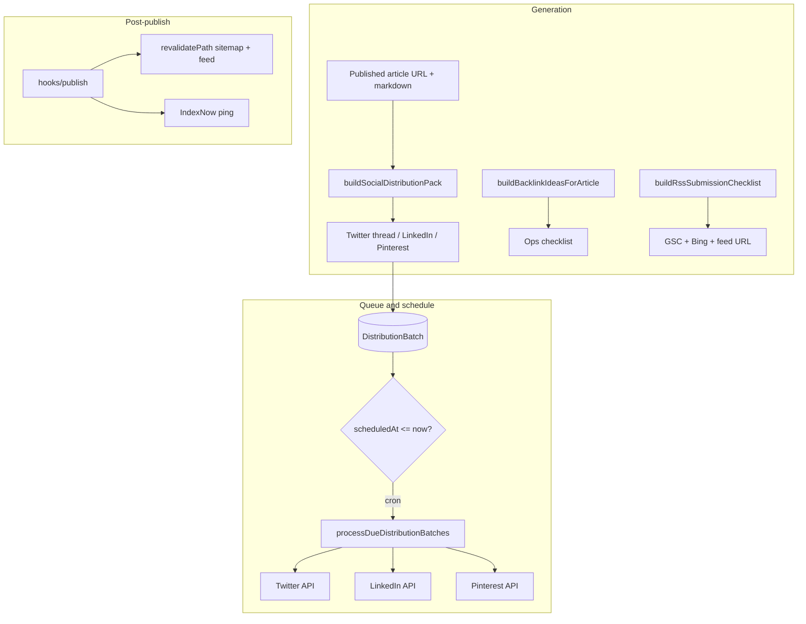

# Distribution engine (RankFlowHQ)

## Architecture



| Layer | Responsibility |
|--------|----------------|
| **Social copy** | `lib/distribution/social-copy.ts` — template-based thread, LinkedIn body, Pinterest title/description (no LLM). |
| **Queue** | `DistributionBatch` in Postgres — `packJson`, `scheduledAt`, `status`. |
| **Worker** | `POST /api/distribution/process` — drains due rows, calls provider adapters. |
| **Providers** | `lib/distribution/providers/social-post.ts` — optional env-based posting. |
| **Discoverability** | `publish-hooks.ts` — `revalidatePath` + IndexNow; RSS at `/feed.xml`; sitemap already dynamic in `app/sitemap.ts`. |

## API integrations

| Platform | Env vars | API notes |
|----------|-----------|-----------|
| **Twitter / X** | `TWITTER_ACCESS_TOKEN` | [POST /2/tweets](https://developer.twitter.com/en/docs/twitter-api/tweets/manage-tweets/api-reference/post-tweets) — OAuth 2.0 **user** token with `tweet.write`. Thread = chain with `reply.in_reply_to_tweet_id`. |
| **LinkedIn** | `LINKEDIN_ACCESS_TOKEN`, `LINKEDIN_AUTHOR_URN` | [UGC Posts API](https://learn.microsoft.com/en-us/linkedin/marketing/integrations/community-management/shares/ugc-post-api) — `urn:li:person:…` or organization URN. |
| **Pinterest** | `PINTEREST_ACCESS_TOKEN`, `PINTEREST_BOARD_ID`, optional `PINTEREST_DEFAULT_IMAGE_URL` | [Pins](https://developers.pinterest.com/docs/api/v5/#operation/pins/create) — requires an **image** URL for standard pins. |
| **IndexNow** | `INDEXNOW_KEY`, `INDEXNOW_KEY_URL` | Already used elsewhere; `hooks/publish` pings URLs after go-live. |
| **Cron** | `CRON_SECRET` | Send `Authorization: Bearer <CRON_SECRET>` to `process` and `hooks/publish` in production. |

Google Search Console has **no** public “ping” for arbitrary URLs; submit `sitemap.xml` once and rely on normal crawling. IndexNow helps Bing/Yandex partners.

## HTTP routes

| Method | Path | Purpose |
|--------|------|---------|
| `POST` | `/api/distribution/generate` | Body: `title`, `canonicalUrl`, `markdown`, optional `primaryKeyword` → `{ pack, backlinkIdeas, rssSubmission }`. |
| `GET` | `/api/distribution/queue` | Auth: Supabase user — list batches. |
| `POST` | `/api/distribution/queue` | Auth — enqueue batch with optional `scheduledAt` (ISO). |
| `POST` | `/api/distribution/process` | Cron — process due batches (Bearer `CRON_SECRET` in prod). |
| `POST` | `/api/distribution/hooks/publish` | Body: `{ urls: string[] }` — revalidate + IndexNow. |
| `GET` | `/feed.xml` | RSS 2.0 for static blog posts. |

## Sample code

### Generate pack (client or server)

```ts
const res = await fetch("/api/distribution/generate", {
  method: "POST",
  headers: { "Content-Type": "application/json" },
  body: JSON.stringify({
    title: "Best AI SEO Tools 2026",
    canonicalUrl: "https://example.com/blog/best-ai-seo-tools-2026",
    markdown: articleMarkdown,
    primaryKeyword: "AI SEO tools",
  }),
});
const { pack, backlinkIdeas, rssSubmission } = await res.json();
```

### After publish — hooks

```bash
curl -X POST "$BASE/api/distribution/hooks/publish" \
  -H "Authorization: Bearer $CRON_SECRET" \
  -H "Content-Type: application/json" \
  -d '{"urls":["https://example.com/blog/new-post"]}'
```

### Cron (Vercel)

```json
{
  "crons": [{ "path": "/api/distribution/process", "schedule": "*/15 * * * *" }]
}
```

Add `Authorization` header in Vercel Cron via middleware or use a query secret (not implemented here).

## Database

Run:

```bash
npx prisma migrate deploy
```

## RSS “submission”

There is no single universal RSS ping for Google. Use:

1. **GSC** — submit `sitemap.xml`.
2. **Bing Webmaster** — submit sitemap.
3. **`/feed.xml`** — give this URL to directories that ask for your feed (optional, mixed value).

See `lib/distribution/rss-submission.ts` for the checklist object returned by `/api/distribution/generate`.
