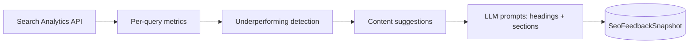

# SEO feedback loop (Google Search Console)

## Data pipeline



1. **Fetch** — `fetchSearchConsolePageQueryMetrics()` (`lib/gsc-queries.ts`) loads **impressions**, **CTR**, and average **position** per query for one **page** URL (28-day window, configurable).
2. **Analyze** — `analyzeUnderperformingKeywords()` + `buildFeedbackLoopAnalysis()` (`lib/seo-feedback-loop.ts`) flag:
   - Low CTR with high impressions  
   - Average position ≥ ~10 (“stuck” past page 1)  
   - Zero clicks with high impressions  
   - CTR below ~50% of page median (when enough rows)
3. **Suggest** — `buildContentUpdateSuggestions()` returns actionable items (expand section, FAQ, internal links, etc.).
4. **Auto-update (prompts)** — `buildFullArticleRefreshBundle()` (`lib/seo-content-refresh.ts`) builds **LLM prompts** to improve H1/H2s and regenerate a priority section (no automatic publish — you merge after review).
5. **Persist (optional)** — `SeoFeedbackSnapshot` stores JSON for trend comparison across cron runs.

## API integrations

| Piece | Implementation |
|--------|------------------|
| **GSC** | Existing `googleapis` webmasters API + service account or OAuth (`GSC_SITE_URL`, `GSC_SERVICE_ACCOUNT_JSON`). |
| **Orchestration** | `runSeoFeedbackPipeline()` in `lib/seo-feedback-pipeline.ts`. |

## HTTP routes

| Route | Purpose |
|--------|---------|
| `POST /api/seo-feedback/analyze` | Run pipeline for one URL; optional `articleMarkdown` to get refresh prompts. Auth: Supabase session, `CRON_SECRET`, dev, or `SEO_FEEDBACK_ALLOW_OPEN=1`. |
| `POST /api/seo-feedback/cron` | Batch URLs from `SEO_FEEDBACK_PAGE_URLS` or body `{ urls }`; saves snapshots. Auth: `CRON_SECRET` in production. |

## Cron job logic

1. Set **`SEO_FEEDBACK_PAGE_URLS`** — comma-separated canonical URLs (e.g. top blog posts).
2. Schedule **`POST /api/seo-feedback/cron`** weekly (e.g. Vercel Cron) with header `Authorization: Bearer $CRON_SECRET`.
3. Each run writes **`SeoFeedbackSnapshot`** rows for trend lines in your own BI or SQL.

## Example: single-page analyze + refresh prompts

```bash
curl -s -X POST "$BASE/api/seo-feedback/analyze" \
  -H "Content-Type: application/json" \
  -H "Authorization: Bearer $CRON_SECRET" \
  -d '{
    "pageUrl": "https://yoursite.com/blog/best-ai-seo-tools-2026",
    "primaryKeyword": "AI SEO tools",
    "articleMarkdown": "'"$(sed 's/"/\\"/g' article.md | head -c 12000)"'",
    "prioritySectionHeading": "What to compare",
    "saveSnapshot": true
  }' | jq '.analysis.underperforming[:3], .refreshBundle.headingsPrompt'
```

## Example update flow (human-in-the-loop)

1. **Cron** writes snapshots → dashboard or email digest of `underperforming` top 5 queries per URL.
2. Editor opens **`refreshBundle.headingsPrompt`** in Gemini / SEO agent → paste revised H1/H2s into CMS.
3. Editor runs **`sectionPrompt`** for the weakest section → merge markdown.
4. Publish → existing **IndexNow** / **sitemap** hooks (`/api/distribution/hooks/publish`).
5. **After 2–4 weeks**, re-run analyze for the same URL and compare snapshots in DB.

## Database

```bash
npx prisma migrate deploy
```

Table: **`SeoFeedbackSnapshot`** (`pageUrl`, `payloadJson`, `createdAt`).

## Limits

- GSC data is **aggregated** and **delayed** (~days); position is **average**, not live rank.
- **Auto-regenerate** in production should stay **reviewed** — prompts are provided, not unsupervised CMS writes.
